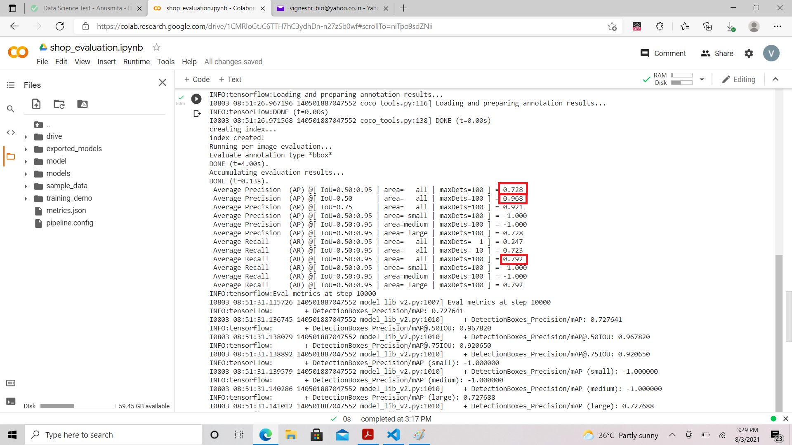

# infilect - Object detection problem

The given problem statement is to create an object detection model that can detect the items in a shelf in a super market and give predictions on the same. The model I chose for this purpose is SSD resnet 50 retinanet 640x640 . This model uses resnet 50 to create the feature map and the retinanet architacture to produce the object detection. The other models I considered for this purpose are SSD mobilenet and SSD resnet 101 retinanet. The reason for choosing this model is that it is not constrained like the mobilenet but also uses less memory compared to SSD resnet 101. If this model did not give good acceptable result I would have chosen SSD resnet 101. 

The project includes:
* shop_tfrecord.ipynb - To generate the tf record for training and testing record
* shop_training.ipynb - training code for SSD resnet 50 Model
* shop_prediction.ipynb - To give predictions of the model
* shop_evaluation.ipynb - gives the evaluation metrics of the model
* image2products.json - product count in each image
* metrics.json - evaluation metrics of test dataset

# Getting started

The code is developed using google colab and google drive as the storage. Please ensure there is atleast 10 GB storage available in the google drive for processing.

## shop_tfrecord.ipynb
* Import the images and csv files from the given links
* create a master dataframe and use the dataframe to generate label file (label_map.pbtxt)
* seperate training and testing dataset from master dataset
* Download and install [tensorflow object detection API](https://tensorflow-object-detection-api-tutorial.readthedocs.io/en/latest/install.html)
* Run Create tfrecord function

## shop_tfrecord.ipynb
* Import the annotation folder(containing *.pbtxt and *.tfrecord) from google drive 
* Download pre-trained-model for transfer learning from [Tensorflow model zoo](https://github.com/tensorflow/models/blob/master/research/object_detection/g3doc/tf2_detection_zoo.md)
* Import pipeline configuration file 
* run Tensorflow Object Detection training function
* create the frozen inference graph from the trained checkpoint model

## shop_prediction.ipynb
* Import the exported frozen inference graph and annotations
* Download and install Tensorflow object detection API
* Run inference code and generate the image2products.json
* This algorithm uses detection score above 0.5 as threshold and number of detected object are counted

## shop_evaluation.ipynb
* Import the model file from google drive
* Run the evaluation metrics using linux commands
* generate the metrics.json file from the outputs
* Further the eval folder created by performing step 2 can be used to view the result in tensorboard(not included in the code)

